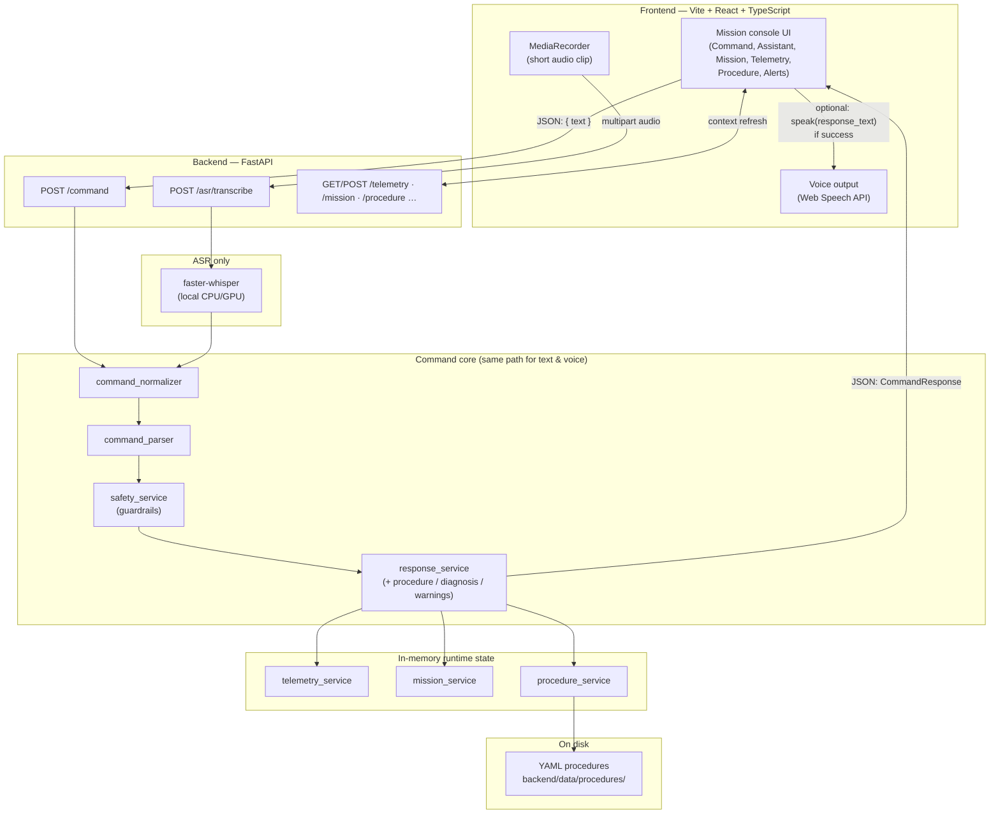
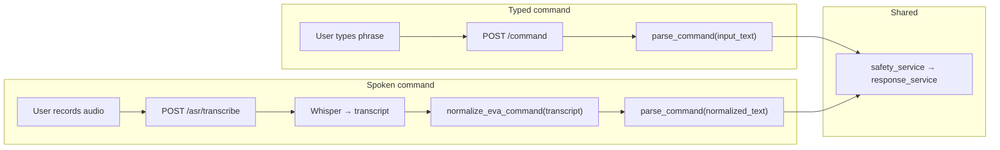
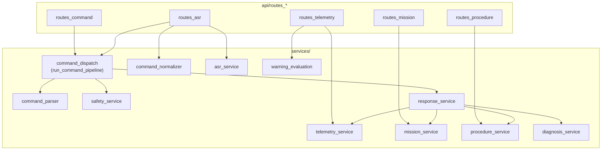

# EVA AIA — Voice-capable mission assistant (demo)

A **deterministic**, safety-oriented EVA-style copilot demo: **typed or spoken** commands, mock suit telemetry, YAML procedures, guardrails, and a React mission console. **No LLM** and **no cloud speech APIs** — local **Whisper** for speech-to-text and the browser’s **Web Speech API** for read-aloud replies.

---

## What you get

| Capability | Description |
|------------|-------------|
| **Commands** | Rule-based parser + guardrails; same pipeline for text and voice. |
| **Voice in** | Browser records short audio → `POST /asr/transcribe` → [faster-whisper](https://github.com/SYSTRAN/faster-whisper) → phrase normalization → parse → respond. |
| **Voice out** | Optional **Voice output** toggle; successful assistant replies use `speechSynthesis` (English-friendly). |
| **Mission / telemetry** | In-memory state; demo defaults for a realistic walkthrough. |
| **Procedures** | YAML under `backend/data/procedures/` (e.g. egress, ERM repair, ingress). |

---

## System design

The diagrams below use [Mermaid](https://mermaid.js.org/) (rendered on GitHub; in other viewers you may see the source code only). An **ASCII overview** of the same EVA pipeline is inlined here and also lives in **[`system.md`](system.md)** at the repo root (handy for slides or plain-text diffs).

### ASCII architecture overview (EVA pipeline)

```text
                          ┌──────────────────────────────┐
                          │        Astronaut User        │
                          │   Voice Command / Text Input │
                          └──────────────┬───────────────┘
                                         │
                     ┌───────────────────┴───────────────────┐
                     │                                       │
                     ▼                                       ▼
        ┌────────────────────────┐              ┌────────────────────────┐
        │   Voice Input (Mic)    │              │   Text Input (UI)      │
        └─────────────┬──────────┘              └─────────────┬──────────┘
                      │                                       │
                      ▼                                       │
        ┌────────────────────────┐                            │
        │ Local ASR (Whisper)    │                            │
        │ Speech → Transcript    │                            │
        └─────────────┬──────────┘                            │
                      │                                       │
                      └───────────────────┬───────────────────┘
                                          ▼
                          ┌──────────────────────────────┐
                          │   Command Normalization      │
                          │  Canonical EVA Command Form  │
                          └──────────────┬───────────────┘
                                         │
                                         ▼
                          ┌──────────────────────────────┐
                          │ Intent Parser / Classifier   │
                          │  Constrained, Rule-Based     │
                          └──────────────┬───────────────┘
                                         │
                                         ▼
                          ┌──────────────────────────────┐
                          │   Guardrails / Safety Layer  │
                          │  Validate / Reject / Confirm │
                          └──────────────┬───────────────┘
                                         │
                                         ▼
                          ┌──────────────────────────────┐
                          │   Command Dispatch Pipeline  │
                          │   Shared by Text + Voice     │
                          └──────────────┬───────────────┘
                                         │
                 ┌───────────────────────┼────────────────────────┐
                 │                       │                        │
                 ▼                       ▼                        ▼
   ┌──────────────────────┐  ┌──────────────────────┐  ┌──────────────────────┐
   │ Mission State Manager│  │ Procedure Engine     │  │ Warning / Alert Logic│
   │ Phase-aware control  │  │ Step-by-step actions │  │ Safety recommendations│
   └────────────┬─────────┘  └────────────┬─────────┘  └────────────┬─────────┘
                │                         │                         │
                └───────────────┬─────────┴───────────────┬─────────┘
                                │                         │
                                ▼                         ▼
                   ┌────────────────────────┐   ┌────────────────────────┐
                   │ Telemetry Service      │   │ Navigation Service     │
                   │ (currently mock,       │   │ (currently stub /      │
                   │ later live TSS feed)   │   │ later live provider)   │
                   └────────────┬───────────┘   └────────────┬───────────┘
                                │                            │
                                └──────────────┬─────────────┘
                                               ▼
                              ┌────────────────────────────────┐
                              │     Response Generator         │
                              │ Concise, mission-safe output   │
                              └──────────────┬─────────────────┘
                                             │
                       ┌─────────────────────┴─────────────────────┐
                       │                                           │
                       ▼                                           ▼
          ┌────────────────────────────┐             ┌────────────────────────────┐
          │ Visual Output (Mission UI) │             │ Voice Output (Browser TTS) │
          │ status / procedure / alert │             │ spoken assistant response   │
          └────────────────────────────┘             └────────────────────────────┘


      External Systems to Integrate Next:
      ┌──────────────────────┐      ┌──────────────────────┐
      │ Real TSS Server      │ ---> │ Telemetry Adapter    │
      └──────────────────────┘      └──────────────────────┘

      ┌──────────────────────┐      ┌──────────────────────┐
      │ Navigation Provider  │ ---> │ Navigation Adapter   │
      └──────────────────────┘      └──────────────────────┘
```

### 1) High-level architecture

End-to-end view: browser, API, in-memory state, and on-disk procedures.



### 2) Text vs voice — request paths

Both modalities converge on **normalized text** before parsing; raw transcript never drives the parser.



### 3) Backend services (logical layering)

How major modules relate inside `backend/app/` (simplified).



**Important:** Raw ASR text is **not** parsed directly. It is **normalized** (`command_normalizer.py`) to canonical phrases, then fed through the same **`run_command_pipeline`** path as `POST /command`.

---

## Tech stack

- **Backend:** Python 3.9+ (3.11+ recommended), FastAPI, Pydantic, PyYAML, faster-whisper (ASR), pytest.
- **Frontend:** Vite, React 19, TypeScript.
- **Tooling:** ffmpeg recommended on the server host for browser audio formats (e.g. WebM).

---

## Repository layout

```
NASA-voice-AI-Assistant/
├── backend/                 # FastAPI app, procedures, tests
│   ├── app/
│   │   ├── api/             # routes: command, asr, telemetry, mission, procedure
│   │   ├── core/            # settings, demo seed
│   │   ├── models/
│   │   └── services/        # parser, safety, ASR, normalizer, procedures, etc.
│   ├── data/procedures/     # YAML procedure definitions
│   └── tests/
├── frontend/                # Vite React UI (`src/`, `utils/tts.ts`)
├── docs/screenshots/        # Optional screenshots for slides/docs
├── system.md                # ASCII architecture diagram (duplicated in README § System design)
├── README.md                # This file
├── backend/README.md        # API endpoint summary
└── frontend/README.md       # Dev server, env, TTS notes
```

---

## Prerequisites

- **Python** 3.11+ recommended (3.9+ generally works).
- **Node.js** 18+ and npm.
- **ffmpeg** on `PATH` if you use **voice input** (browser often sends WebM).  
  - macOS: `brew install ffmpeg`  
  - Ubuntu/Debian: `sudo apt install ffmpeg`
- **Microphone** permission in the browser for the Mic control.

---

## Quick start

### 1. Backend

```bash
cd backend
python3 -m venv .venv
source .venv/bin/activate          # Windows: .venv\Scripts\activate
pip install -r requirements.txt
uvicorn app.main:app --reload --host 0.0.0.0 --port 8000
```

- API docs: [http://localhost:8000/docs](http://localhost:8000/docs)  
- Health: [http://localhost:8000/health](http://localhost:8000/health)

### 2. Frontend

```bash
cd frontend
npm install
npm run dev
```

Open the printed URL (usually **http://localhost:5173**).  
Default API base: `http://localhost:8000` (override with `VITE_API_ORIGIN` if needed).

### 3. Production build (frontend)

```bash
cd frontend
npm run build
npm run preview    # optional local preview
```

---

## Configuration (environment variables)

All backend app settings use the **`EVA_`** prefix (see `backend/app/core/config.py`). You can use a `backend/.env` file.

### Core

| Variable | Default | Description |
|----------|---------|-------------|
| `EVA_DEMO_MODE` | `true` | `true`: start in **EGRESS** with demo telemetry. `false`: **INIT** + training telemetry (also what tests assume after reset). |
| `EVA_CORS_ORIGINS` | `["http://localhost:5173", ...]` | JSON array of allowed browser origins. |

### Local ASR (voice input)

| Variable | Default | Description |
|----------|---------|-------------|
| `EVA_ASR_ENABLED` | `true` | `false` disables `POST /asr/transcribe` (returns 503). |
| `EVA_ASR_MODEL_SIZE` | `base` | Whisper model: `tiny`, `base`, `small`, etc. |
| `EVA_ASR_DEVICE` | `cpu` | `cpu` or `cuda`. |
| `EVA_ASR_COMPUTE_TYPE` | `int8` | e.g. `int8`, `float16` (depends on device). |
| `EVA_ASR_MIN_AVG_LOGPROB` | `-2.0` | Reject low-confidence transcriptions. |
| `EVA_ASR_MAX_NO_SPEECH_PROB` | `0.75` | Reject when Whisper reports high non-speech probability. |

First successful transcription downloads model weights (size depends on `EVA_ASR_MODEL_SIZE`).

### Frontend

| Variable | Description |
|----------|-------------|
| `VITE_API_ORIGIN` | Override API base URL (default `http://localhost:8000`). |

---

## Voice input (ASR)

1. Start backend + frontend; ensure **ffmpeg** is available if using recorded WebM/MP3.
2. In the **Command** panel, click **Mic**, speak a short phrase, then **Stop**.
3. The **Assistant** panel shows **Transcript** and **Normalized** text, then the same structured reply as typed commands when routing succeeds.

**Tips**

- If ASR is slow or heavy on CPU, try `EVA_ASR_MODEL_SIZE=tiny` or set `EVA_ASR_ENABLED=false` to use text-only.
- Phrase normalization maps common spoken variants to parser-safe phrases (e.g. oxygen / battery status wording). See `backend/app/services/command_normalizer.py`.

---

## Voice output (TTS)

- Toggle **Voice output** in the header (default **on**).
- Only **successful** assistant replies (`success: true`) are spoken; guardrail rejections and errors are **not** read aloud.
- Only **`response_text`** is passed to the synthesizer (not raw transcript or normalized command).
- Uses **`window.speechSynthesis`** (Web Speech API). The implementation prefers English voices and normalizes Unicode subscripts (e.g. O₂) for reliable playback. **Chrome** may require a user click on the page before speech is audible; if silent, click once in the page and try again. Check system volume and browser tab mute.

Details: [`frontend/src/utils/tts.ts`](frontend/src/utils/tts.ts), [`frontend/README.md`](frontend/README.md).

---

## Tests

```bash
cd backend
source .venv/bin/activate
pytest
```

Tests reset mission/telemetry/procedure state so results are stable regardless of `EVA_DEMO_MODE`. Frontend: `npm run build` checks TypeScript and the Vite production build.

---

## Example demo flow

With **demo mode** on (default), phase starts as **EGRESS** and telemetry is realistic.

1. **Oxygen** — `oxygen status` or say a natural variant (e.g. “what’s my oxygen status?” after normalization).
2. **Egress procedure** — `start egress` then `next step` / `repeat step` as needed.
3. **Phase change** — In **Mission status**, pick e.g. **LTV_REPAIR**, **Set phase**.
4. **ERM** — `start erm` or `start repair`.
5. **Diagnosis** — `run diagnosis` (stub depends on telemetry / phase).
6. **Warnings** — `any warnings` or watch **Alerts**.
7. **Return route** — Set **EVA_NAV** or **INGRESS**, then `guide me back` or `return route`.

Adjust **Telemetry** sliders and refresh to see **Alerts** change.

---

## Troubleshooting

| Issue | What to try |
|-------|-------------|
| ASR 503 | `EVA_ASR_ENABLED=true`, dependencies installed, restart API. |
| ASR silent / empty | Microphone permission; speak clearly; check ffmpeg for WebM. |
| TTS silent | Toggle **Voice output**; click the page once; unmute tab/system; try Chrome/Edge. |
| CORS errors | Add your dev origin to `EVA_CORS_ORIGINS`. |
| Parser “unknown” | Use phrases from `help` or match normalized vocabulary in `command_parser.py` / `command_normalizer.py`. |

---

## Documentation links

- [`backend/README.md`](backend/README.md) — Endpoint table and mission phases.
- [`frontend/README.md`](frontend/README.md) — `VITE_API_ORIGIN`, build, TTS.
- [`docs/screenshots/README.md`](docs/screenshots/README.md) — Optional screenshot placeholders.

---

## License

No license file is bundled with this prototype; add a `LICENSE` if you distribute or reuse the project publicly.
